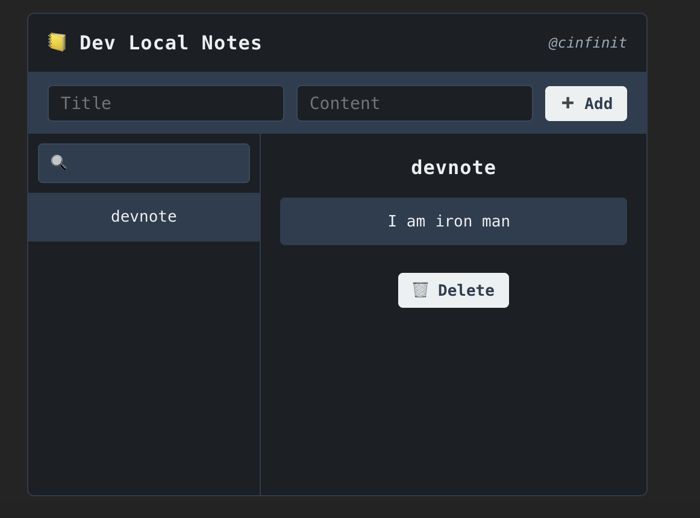

# 🗒️ Dev-local-notes [](https://www.npmjs.com/package/dev-local-notes) [](https://npmjs.org/package/dev-local-notes)


> _A gloriously overengineered sticky note for your terminal-brain. Like Post-its, but they speak fluent JSON and run on localhost._

---

## ✨ What is this?

**Dev Local Notes** is a lightweight, hackable local notes tool for developers — perfect for jotting down ideas, logs, debugging info, or that one-off regex you know you'll forget in 5 minutes. It runs entirely on your machine, stores everything in a local JSON file, and has zero cloud dependency. Yes, zero.

Use it like a DevTool. Or a debugging buddy. Or an ephemeral clipboard. The point is: **your notes stay local, stay yours, and stay fast**.

---

## 🧠 Why?

Because sometimes you just want a scratchpad that:
- Doesn't ask you to create an account
- Doesn't sync to 9 other devices
- Doesn't lose your notes when the page reloads
- Doesn’t try to Markdown-ify your thoughts into a novel

This tool gives you a split-view of:
- All your notes (with search)
- The full content of the selected one
- Live editing (double-click to edit titles/content)
- A clean, terminal-inspired aesthetic that fits right into your dev environment

---

## 🚀 Features

- 📁 Local storage using JSON
- ⚛️ React-based Clean UI
- 🔍 Real-time filtering by title/content
- ✏️ In-place editing with validation (no empty notes!)
- ➕ Add / 🗑 Delete notes , yeah it’s the simplest feature we could give ,nothing fancy ;)
- ⌨️ No distractions, just you and your brain dump
- 🌘 And yes — we ship dark mode by default. Unlike certain billion-dollar docs apps 👀. No offense 😉. They will get their , someday 🤷‍♂️.

---

## 📦 Installation & Usage

```bash
npm install dev-local-notes
```
Then, start the server locally:
npx localdevnotes-server

It will start at PORT 1347

Now, hook it up in your React app:

```bash
import { NotesTable } from "dev-local-notes";


function App() {
  return (
    <div>
      {/* Your other components */}
      <NotesTable />
    </div>
  );
}
```



## 🧙‍♂️ Pro Tips
- Double-click a note's title or content to edit.
- Don't worry about breaking stuff — it's just a local file.
- Use it while debugging — like a local state memory bank.
- No network calls leave your machine. This thing’s as offline as it gets.


## 🪜 Bonus Coolness

- Timeline on the left, detail view on the right. IDE vibes.
- Supports fast edits, no-friction usage, and zero configuration.
- Perfect for solo projects, side quests, and late-night debugging rants.
- Wanna feel like a hacker? Keep this open in a side panel. Boom.


## 🧙‍♂️ Philosophy 
Other tools want to “sync” your thoughts across devices.
 We just want you to keep them long enough to use them.
This tool doesn’t scale. It doesn’t pretend to.
 But it shows up when you need it — kind of like a rubber duck that listens and takes notes. 🦆

## 🤘 Final Word
Forgetting is human. Note-taking is divine.
Use Dev Local Notes. Keep it local. Keep it simple.
“Save locally. Dream globally.”


## 🧑‍💻 About the Author
Crafted with ☕, 🧠, and a suspicious number of local notes by [cinfinit](https://github.com/cinfinit) — a dev who believes that every genius idea starts as a local note (and might end up as a global one).

"If it’s not written down locally, did you even think it?" — Probably Confucius, maybe not.
